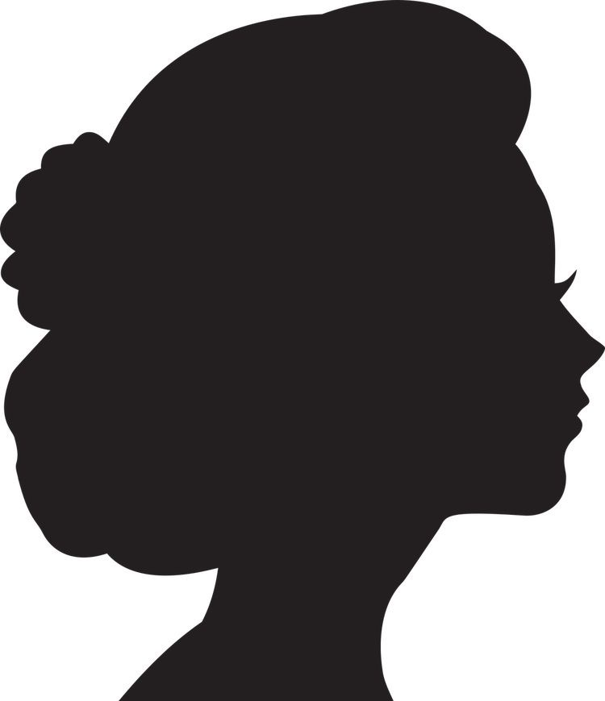

<!DOCTYPE html>
<html lang="en">

<head>
  <meta charset="UTF-8">
  <meta name="viewport" content="width=device-width, initial-scale=1, shrink-to-fit=no">

  <title>Meg</title>
  <link rel="stylesheet" type="text/css" href="styles copy.css">
  <link rel="stylesheet" href="https://fonts.googleapis.com/css?family=Roboto:300,400,500,700|Material+Icons">
</head>
<header>
  
  

    <h1>Guten Tag!</h1>
    <h2>Willkommen auf meiner Webseite</h2>
  

  <nav>
    <a href="#">Über mich</a>
    <a href="#erf">Meine Erfahrungen</a>
    <a href="#proj">Meine Projekte</a>
  </nav>
</header>

<body>
  <main class="container">
    
    

      
      <ul class="info">
        <li>Vorname Nachname</li>
        <li>XX Jahre</li>
      </ul>
    

    
    
    
 html {
  scroll-behavior: smooth;
}

/* ----------HEADER----------*/
#sky {
  width: 100%;
  height: 300px;
  margin: 0;
}

.hallo {
  width: 100%;
  padding-left: 2rem;
  margin-bottom: 30px;
  color: rgb(27 197 250)
}

h1 {
  font-size: 2.5rem;
}

h2 {
  font-size: 2rem;
}

h1,
h2 {
  margin: 0 0 .5rem 0;
  font-weight: 500;
  line-height: 1.2;
}

/* ----------BODY----------*/
*,
::after,
::before {
  box-sizing: border-box;
}

body {
  margin-top: 0;
  font-family: -apple-system, BlinkMacSystemFont, "Segoe UI", Roboto, "Helvetica Neue", Arial, "Noto Sans", sans-serif, "Apple Color Emoji", "Segoe UI Emoji", "Segoe UI Symbol", "Noto Color Emoji";
  font-weight: 400;
  line-height: 1.5;
}

.container {
  max-width: 1140px;
  padding: 0 0.5rem;
  margin: 0 auto;

}

/* -- bild und name -- */
.profil-head {
  display: flex;
  width: 100%;
}

#profil {
  width: 25%;
  margin: 1rem 4rem 2rem 0;
}

.info {
  font-size: 2rem;
  align-self: center;
}

li {
  list-style-type: none;
}

/* -- bild und name END -- */

p {
  font-size: 2rem;
}

h2 {
  color: rgb(27 197 250)
}

nav {
  background-color: rgb(76 224 253 / 42%);
  position: absolute;
  letter-spacing: 1px;
  border-radius: 2rem;
  right: 23px;
  top: 347px;
  padding: 1rem;
  font-size: 130%;
}

a {
  color: #0065ffc4;
  text-decoration: none;
  padding: 0 0.5rem;
}

a:hover {
  color: #004ec2c4;
}

/* ----------FOOTER----------*/
footer {
  margin-top: 0.5rem;
  padding-top: 0.2rem;
  text-align: center;
  bottom: 0;
  width: 100%;
  height: 105px;
  background-color: #fafafa;
}

.material-icons {
  vertical-align: middle;
}

.mbtn {
  display: inline-block;
  text-align: center;
  border: 1px solid transparent;
  padding: .375rem .75rem;
  border-radius: 2.25rem;
  color: #fff;
  background-color: #1bc5fac2;
  border-color: #1bc5fac2;
  width: 3.5rem;
  min-width: 3.5rem;
  height: 3.5rem;
  box-shadow: 0 1px 1.5px 0 rgba(0, 0, 0, .12), 0 1px 1px 0 rgba(0, 0, 0, .26);
}

.mbtn:hover {
  background-color: #06b8f0c2;
  border-color: #06b8f0c2;
  color: #f8f8f8
}

.btn-position {
  position: fixed;
  right: 23px;
  bottom: 23px;
  padding-top: 15px;
  margin-bottom: 0;
  z-index: 997;
}

@media (max-width: 562px) {
  .menu {
    display: flex;
    justify-content: space-around;
    position: static;
    border-radius: 2rem;
    margin: 0;
    padding: 0.5rem;
    font-size: 100%;
    width: 100%;
  }
}

@media (max-width: 992px) {
  #sky {
    height: 30%;
  }

  h1 {
    font-size: 1.5rem;
  }

  h2 {
    font-size: 1.2rem;
  }

  .hallo {
    margin-bottom: 1rem;
  }

  .container {
    max-width: 620px;
    padding: 0 0.5rem;
    margin: 0 auto;
  }

  p {
    font-size: 1.3rem;
    margin-top: 0.5rem;
  }

  .menu {
    display: flex;
    justify-content: space-around;
    position: static;
    border-radius: 2rem;
    margin: 0;
    padding: 1rem;
    font-size: 130%;
    width: 100%;
  }

  #profil {
    width: 40%;
    height: auto;
    margin-right: 1rem;
  }

  .info {
    font-size: 1.2rem;
    align-self: center;
  }

  .mbtn {
    width: 5.5rem;
    height: 5.5rem;
    border-radius: 4.25rem;
  }

  .material-icons {
    font-size: 45px !important;
  }
}
